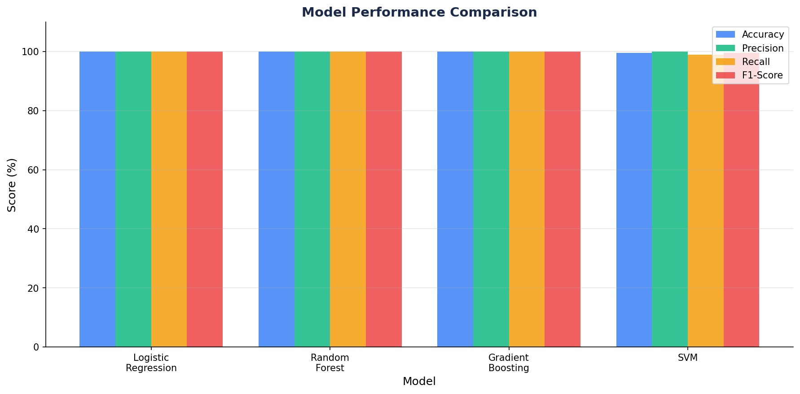
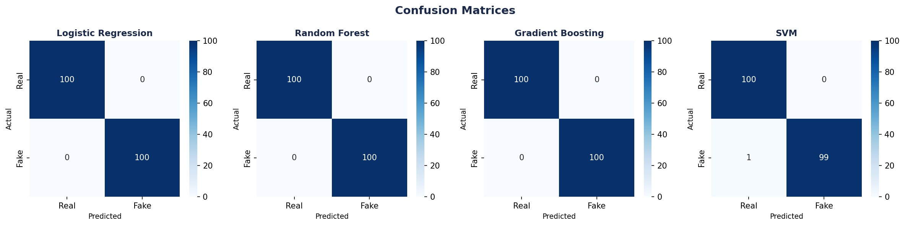
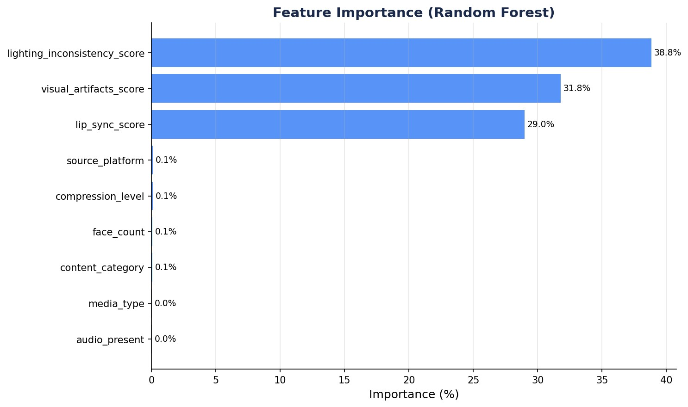

## Overview

This was a research report where I got to choose a dataset on Kaggle and 
apply 4 classification algorithms to the dataset using Python. 
The dataset I chose was deepfake detection data that contained various features for the 
models to determine whether the media data was real or fake. Various pre-processing and 
exploratory data analysis steps were needed before applying the models. 
The results showed exceptional accuracy, but these results were reflective of the synthetic, 
balanced nature of the dataset rather than the model's efficiency.

## Libraries Used

```{python}
#| eval: false
import pandas as pd
import numpy as np
import warnings
warnings.filterwarnings('ignore')

from sklearn.model_selection import train_test_split, StratifiedKFold, cross_val_score
from sklearn.preprocessing import LabelEncoder, StandardScaler
from sklearn.linear_model import LogisticRegression
from sklearn.ensemble import RandomForestClassifier, GradientBoostingClassifier
from sklearn.svm import SVC
from sklearn.metrics import (
    accuracy_score, precision_score, recall_score,
    f1_score, roc_auc_score, confusion_matrix, classification_report
)
```

## Data Preprocessing

The dataset was loaded and cleaned by removing irrelevant columns. Categorical variables were 
encoded using a Label Encoder and the target label was converted to a binary format.

```{python}
#| eval: false
df = pd.read_excel('deepfake_detection_metadata_dataset.csv.xlsx')

df = df.drop(columns=['generation_method', 'media_id'])

categorical_cols = ['media_type', 'content_category', 'audio_present', 'source_platform']
le = LabelEncoder()
for col in categorical_cols:
    df[col] = le.fit_transform(df[col].astype(str))

df['label'] = (df['label'] == 'Fake').astype(int)
```

## Feature Selection & Train/Test Split

Nine features were selected based on their relevance to deepfake detection. The data was split 
80/20 into training and test sets using stratified sampling to preserve class balance.

```{python}
#| eval: false
FEATURES = [
    'media_type', 'content_category', 'face_count', 'audio_present',
    'lip_sync_score', 'visual_artifacts_score', 'compression_level',
    'lighting_inconsistency_score', 'source_platform'
]

X = df[FEATURES]
y = df['label']

X_train, X_test, y_train, y_test = train_test_split(
    X, y, test_size=0.20, random_state=42, stratify=y
)

scaler = StandardScaler()
X_train_scaled = scaler.fit_transform(X_train)
X_test_scaled  = scaler.transform(X_test)
```

## Model Training & Evaluation

Four models were trained and evaluated — Logistic Regression, Random Forest, Gradient Boosting, 
and SVM. Each was assessed using accuracy, precision, recall, F1-score, and 5-fold cross validation.

```{python}
#| eval: false
models = {
    'Logistic Regression': {
        'model': LogisticRegression(C=1.0, max_iter=1000, random_state=42),
        'needs_scaling': True,
    },
    'Random Forest': {
        'model': RandomForestClassifier(n_estimators=100, random_state=42),
        'needs_scaling': False,
    },
    'Gradient Boosting': {
        'model': GradientBoostingClassifier(n_estimators=100, learning_rate=0.1, random_state=42),
        'needs_scaling': False,
    },
    'SVM': {
        'model': SVC(kernel='rbf', C=1.0, probability=True, random_state=42),
        'needs_scaling': True,
    },
}

results = {}

for name, cfg in models.items():
    model  = cfg['model']
    X_tr   = X_train_scaled if cfg['needs_scaling'] else X_train
    X_te   = X_test_scaled  if cfg['needs_scaling'] else X_test

    model.fit(X_tr, y_train)
    y_pred = model.predict(X_te)
    y_prob = model.predict_proba(X_te)[:, 1]

    cv_scores = cross_val_score(
        model, X_tr, y_train,
        cv=StratifiedKFold(n_splits=5, shuffle=True, random_state=42),
        scoring='f1',
    )

    results[name] = {
        'accuracy':  accuracy_score(y_test, y_pred),
        'precision': precision_score(y_test, y_pred),
        'recall':    recall_score(y_test, y_pred),
        'f1':        f1_score(y_test, y_pred),
        'cv_mean':   cv_scores.mean(),
        'cv_std':    cv_scores.std(),
        'confusion': confusion_matrix(y_test, y_pred),
    }
```

## Feature Importance

The Random Forest model was used to rank the importance of each feature in predicting 
whether media was real or fake.

```{python}
#| eval: false
rf_model = models['Random Forest']['model']
importances = pd.Series(rf_model.feature_importances_, index=FEATURES)
importances_sorted = importances.sort_values(ascending=False)

for feat, imp in importances_sorted.items():
    bar = '█' * int(imp * 50)
    print(f"  {feat:<35} {imp*100:5.2f}%  {bar}")
```

## Results Summary

```{python}
#| eval: false
summary = pd.DataFrame({
    name: {
        'Accuracy (%)':  round(v['accuracy']  * 100, 2),
        'Precision (%)': round(v['precision'] * 100, 2),
        'Recall (%)':    round(v['recall']    * 100, 2),
        'F1-Score (%)':  round(v['f1']        * 100, 2),
        'CV F1 (%)':     round(v['cv_mean']   * 100, 2),
    }
    for name, v in results.items()
}).T

print(summary.to_string())
```

### Model Performance Comparison


### Confusion Matrices


### Feature Importance


## Project Files
To view the Python file and project report, click the links.
[View Python Script](../projectfiles/Deepfakedetection-python.py){.btn .btn-outline-primary}
[View PDF Report](../projectfiles/ML-Comparative-Analysis.pdf){.btn .btn-outline-primary target="_blank"}